# Secure CI/CD Pipeline for Multi-Container Notes Application — ECS Fargate with SAST/SCA

A production-grade full-stack Notes application deployed on AWS ECS Fargate with comprehensive security scanning, blue/green deployments, and automated quality gates. This project demonstrates enterprise-level DevOps practices including SAST, SCA, container vulnerability scanning, SBOM generation, secret detection, and zero-downtime deployments using AWS CodeDeploy.

---

## Table of Contents

- [Project Overview](#project-overview)
- [Motivation](#motivation)
- [Architecture](#architecture)
- [Security Pipeline](#security-pipeline)
- [Key Technologies](#key-technologies)
- [Prerequisites](#prerequisites)
- [Installation](#installation)
- [Usage](#usage)
- [CI/CD Pipeline](#cicd-pipeline)
- [Security Scanning](#security-scanning)
- [ECS Deployment](#ecs-deployment)
- [Blue/Green Deployment Strategy](#bluegreen-deployment-strategy)
- [Monitoring & Observability](#monitoring--observability)
- [Project Structure](#project-structure)
- [Learning Outcomes](#learning-outcomes)
- [Challenges & Solutions](#challenges--solutions)
- [Evidence & Validation](#evidence--validation)
- [Future Improvements](#future-improvements)
- [Contributing](#contributing)
- [License](#license)
- [Author](#author)

---

## Project Overview

This project implements a secure, automated CI/CD pipeline for a containerized Notes application consisting of four services: Nginx reverse proxy, Next.js frontend, NestJS backend API, and PostgreSQL database. The pipeline integrates multiple security scanning tools (SAST, SCA, image scanning, secret detection) with quality gates that block deployment when critical vulnerabilities are detected.

The application is deployed to AWS ECS Fargate using blue/green deployment strategy via AWS CodeDeploy, ensuring zero-downtime releases with automatic rollback capabilities. All infrastructure is provisioned using Terraform, and the entire deployment process is automated through Jenkins.

**Key Highlights:**
- **Security-First Approach**: SAST (SonarCloud), SCA (npm audit), container scanning (Trivy), secret detection (Gitleaks)
- **Quality Gates**: Pipeline fails on Critical/High vulnerabilities or exposed secrets
- **Zero-Downtime Deployments**: Blue/green strategy with 10% traffic shifting per minute
- **Automatic Rollback**: CloudWatch alarms trigger rollback on 5xx errors
- **SBOM Generation**: Software Bill of Materials in CycloneDX and SPDX formats
- **Infrastructure as Code**: Complete AWS infrastructure provisioned via Terraform
- **Comprehensive Monitoring**: Prometheus, Grafana, Alertmanager with Slack notifications

---

## Motivation

This project was built to master enterprise-grade DevOps security practices and container orchestration on AWS. The primary goals were to:

- **Implement security scanning at every stage** of the CI/CD pipeline to catch vulnerabilities before production
- **Integrate quality gates** that enforce security standards and prevent deployment of vulnerable code
- **Master AWS ECS Fargate** for serverless container orchestration with reduced operational overhead
- **Implement blue/green deployments** using AWS CodeDeploy for zero-downtime releases
- **Generate and maintain SBOMs** for supply chain security and compliance requirements
- **Automate infrastructure provisioning** using Terraform for reproducible, version-controlled cloud resources
- **Demonstrate industry-standard practices** suitable for enterprise environments and security-conscious organizations

This project represents the evolution from manual EC2 deployments to production-ready, security-hardened container orchestration with automated quality enforcement.

---

## Architecture

### System Architecture

The application follows a microservices architecture with four containerized services running on AWS ECS Fargate:

1. **Nginx Proxy** (Port 80): Reverse proxy handling all incoming traffic, routing requests to frontend or backend
2. **Next.js Frontend** (Port 3000): Server-side rendered React application for the user interface
3. **NestJS Backend** (Port 3001): RESTful API with TypeORM for database operations and Prometheus metrics endpoint
4. **PostgreSQL Database** (Port 5432): Relational database running in isolated network, accessible only by backend

Traffic flows through an Application Load Balancer (ALB) to the Nginx proxy container, which routes requests based on path:
- `/api/*` → Backend API
- `/*` → Frontend application

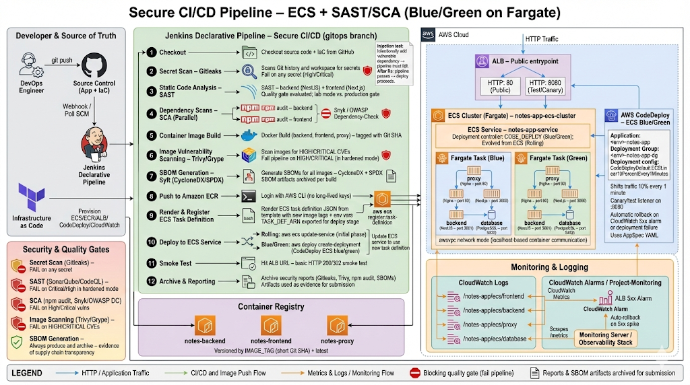

### ECS Fargate Architecture

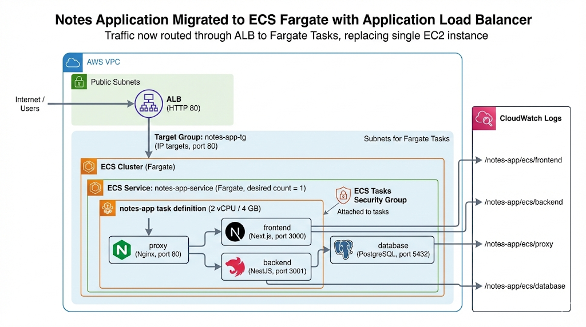

The ECS deployment uses:
- **Fargate Launch Type**: Serverless compute for containers (no EC2 management)
- **awsvpc Network Mode**: Each task gets its own ENI with private IP
- **Application Load Balancer**: Distributes traffic across healthy tasks
- **CloudWatch Logs**: Centralized logging for all containers
- **Container Insights**: Enhanced monitoring and metrics

### Blue/Green Deployment Architecture

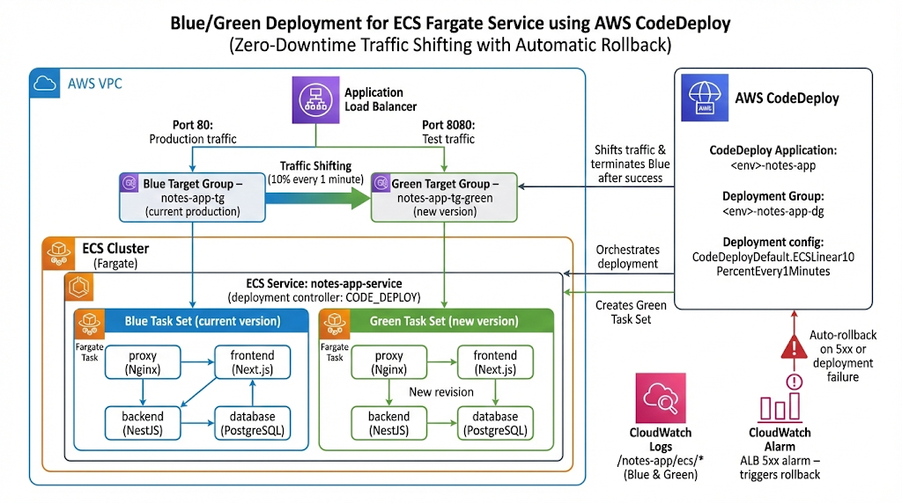

AWS CodeDeploy orchestrates blue/green deployments:
- **Blue Target Group**: Current production tasks
- **Green Target Group**: New deployment tasks
- **Production Listener** (Port 80): Serves live traffic
- **Test Listener** (Port 8080): Validates green deployment before traffic shift
- **Linear Traffic Shifting**: 10% per minute with automatic rollback on failure

---

## Security Pipeline

This project implements a comprehensive security scanning pipeline that validates code, dependencies, and container images before deployment. All scans are integrated into the Jenkins CI/CD pipeline with configurable quality gates.

### Security Scanning Stages

| Stage | Tool | Purpose | Gate Behavior |
|-------|------|---------|---------------|
| **Secret Scanning** | Gitleaks 8.21.2 | Detect hardcoded secrets, API keys, credentials in source code | Reports findings (lab mode: non-blocking) |
| **Static Code Analysis** | TypeScript Compiler + ESLint | Type checking and code quality for backend/frontend | Fails on compilation errors |
| **Dependency Security Audit** | npm audit | Identify vulnerable dependencies (HIGH/CRITICAL) | Reports findings (lab mode: non-blocking) |
| **Code Quality Analysis** | SonarCloud | Code smells, bugs, security hotspots, technical debt | Quality gate enforced (lab mode: non-blocking) |
| **Container Vulnerability Scan** | Trivy | Scan Docker images for OS and application vulnerabilities | Reports HIGH/CRITICAL CVEs (lab mode: non-blocking) |
| **SBOM Generation** | Syft | Generate Software Bill of Materials for supply chain security | Always succeeds, archives artifacts |

### Quality Gate Configuration

**Production Mode** (recommended for real deployments):
- Pipeline **FAILS** if Gitleaks detects any secrets
- Pipeline **FAILS** if npm audit finds HIGH or CRITICAL vulnerabilities
- Pipeline **FAILS** if SonarCloud quality gate fails
- Pipeline **FAILS** if Trivy finds CRITICAL vulnerabilities in images

**Lab Mode** (current configuration for testing):
- All scans execute and generate reports
- Findings are logged and archived as build artifacts
- Pipeline continues to deployment stage for demonstration purposes
- Allows testing of vulnerable dependencies and rollback mechanisms

### Security Reports Generated

All security scan results are archived as Jenkins build artifacts:

```
Build Artifacts/
├── gitleaks-report.json          # Secret scan results (JSON)
├── gitleaks-report.csv           # Secret scan results (CSV)
├── npm-audit-backend.json        # Backend dependency vulnerabilities
├── npm-audit-frontend.json       # Frontend dependency vulnerabilities
├── trivy-backend.json            # Backend image CVE scan
├── trivy-frontend.json           # Frontend image CVE scan
├── trivy-proxy.json              # Proxy image CVE scan
├── sbom-backend-cyclonedx.json   # Backend SBOM (CycloneDX format)
├── sbom-backend-spdx.json        # Backend SBOM (SPDX format)
├── sbom-frontend-cyclonedx.json  # Frontend SBOM (CycloneDX format)
├── sbom-frontend-spdx.json       # Frontend SBOM (SPDX format)
├── sbom-proxy-cyclonedx.json     # Proxy SBOM (CycloneDX format)
└── sbom-proxy-spdx.json          # Proxy SBOM (SPDX format)
```

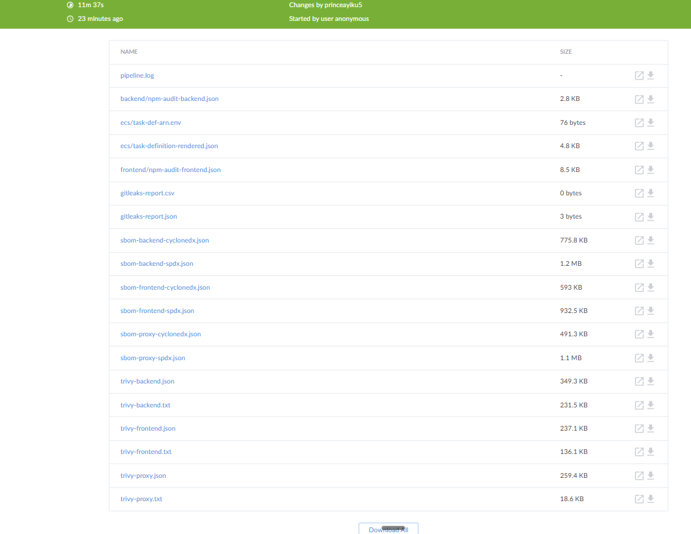

---

## Key Technologies

### Core Application Stack

- **Docker & Docker Compose**: Containerization for consistent environments across development and production. Chosen for portability and isolation.
- **Nginx**: Reverse proxy for request routing, load balancing, and single entry point. Provides SSL termination capability and rate limiting.
- **NestJS**: Backend API framework with TypeScript, TypeORM, and dependency injection. Provides structure, type safety, and built-in testing support.
- **Next.js 14**: Frontend framework with React Server Components and server-side rendering. Optimizes performance and SEO.
- **PostgreSQL 15**: Relational database with ACID compliance. Runs in isolated network accessible only by backend.

### AWS Infrastructure

- **Amazon ECS Fargate**: Serverless container orchestration eliminating EC2 management overhead. Auto-scales based on demand.
- **Application Load Balancer (ALB)**: Layer 7 load balancing with health checks, SSL termination, and path-based routing.
- **Amazon ECR**: Private container registry integrated with IAM. Avoids Docker Hub rate limits and provides vulnerability scanning.
- **AWS CodeDeploy**: Blue/green deployment orchestration with automatic rollback. Ensures zero-downtime releases.
- **CloudWatch Logs**: Centralized logging with log groups per container. Enables debugging and audit trails.
- **CloudWatch Alarms**: Monitors ALB 5xx errors and triggers automatic rollback on deployment failures.

### Infrastructure as Code

- **Terraform 1.0+**: Provisions all AWS resources (ECS, ALB, ECR, IAM, CodeDeploy, CloudWatch). Enables version-controlled, reproducible infrastructure.
- **AWS IAM Roles**: Least-privilege access for ECS tasks, CodeDeploy, and CI/CD. No long-lived credentials.

### CI/CD & Automation

- **Jenkins**: Self-hosted CI/CD server with declarative pipeline. Orchestrates build, test, scan, and deployment stages.
- **GitHub Actions**: Alternative CI/CD workflow for SSH-based EC2 deployments (legacy path).
- **GitHub OIDC**: Federated authentication for AWS without static credentials. Short-lived tokens for enhanced security.

### Security Scanning Tools

- **SonarCloud**: Cloud-based SAST platform analyzing code quality, security vulnerabilities, and technical debt. Integrates with Jenkins via SonarQube Scanner plugin.
- **Gitleaks 8.21.2**: Secret detection tool scanning git history and source code for exposed credentials, API keys, and tokens.
- **npm audit**: Built-in Node.js tool identifying known vulnerabilities in dependencies using the npm advisory database.
- **Trivy**: Comprehensive container image scanner detecting OS and application vulnerabilities. Supports multiple formats (JSON, table, SARIF).
- **Syft**: SBOM generation tool creating software bill of materials in CycloneDX and SPDX formats for supply chain security.

### Monitoring & Observability

- **Prometheus 2.51.2**: Time-series database scraping metrics every 15 seconds. Stores 15 days of data with configurable retention.
- **Alertmanager 0.27.0**: Alert routing and notification service. Groups, deduplicates, and routes alerts to Slack.
- **Grafana 10.4.2**: Metrics visualization with pre-provisioned dashboards. Auto-configured Prometheus datasource.
- **Node Exporter 1.8.2**: Exposes OS-level metrics (CPU, memory, disk, network) for infrastructure monitoring.

All monitoring images are pulled from **ECR Public Gallery** (`public.ecr.aws/bitnami/...`) to avoid Docker Hub rate limits.

---

## Prerequisites

### Required Software

- **Docker** 24.0+ — Container runtime for local development and image building
- **Docker Compose** v2+ — Multi-container orchestration for local testing
- **Terraform** 1.0+ — Infrastructure provisioning on AWS
- **AWS CLI** v2 — Command-line interface for AWS operations
- **Node.js** 20.x — For local development and testing (optional)
- **Git** — Version control and repository management
- **Jenkins** 2.400+ — CI/CD server (or use GitHub Actions alternative)

### AWS Requirements

- **AWS Account** with permissions for:
  - ECS (Fargate, Task Definitions, Services, Clusters)
  - ECR (Repositories, Image Push/Pull)
  - IAM (Roles, Policies, OIDC Provider)
  - VPC (Subnets, Security Groups)
  - Application Load Balancer (ALB, Target Groups, Listeners)
  - CodeDeploy (Applications, Deployment Groups)
  - CloudWatch (Logs, Alarms, Metrics)
  - CloudTrail (optional, for audit logging)
  - GuardDuty (optional, for threat detection)

- **AWS Credentials** configured locally:
  ```bash
  aws configure
  # Enter Access Key ID, Secret Access Key, Region (e.g., eu-west-1)
  ```

### Jenkins Requirements

If using Jenkins pipeline (recommended for full security scanning):

**Required Plugins:**
- Pipeline (workflow-aggregator)
- Git
- Docker Pipeline
- AWS Credentials
- Amazon ECR
- SonarQube Scanner
- SSH Agent
- Slack Notification
- Timestamper
- Workspace Cleanup
- AnsiColor
- HTML Publisher

**Required Credentials** (Manage Jenkins → Credentials → Global):

| Credential ID | Type | Description |
|---------------|------|-------------|
| `aws-access-key-id` | Secret Text | AWS Access Key ID |
| `aws-secret-access-key` | Secret Text | AWS Secret Access Key |
| `aws-region` | Secret Text | AWS region (e.g., `eu-west-1`) |
| `ecr-registry` | Secret Text | ECR registry URL: `<account>.dkr.ecr.<region>.amazonaws.com` |
| `db-username` | Secret Text | PostgreSQL username |
| `dbpassword` | Secret Text | PostgreSQL password |
| `db-name` | Secret Text | PostgreSQL database name |
| `sonarcloud-token` | Secret Text | SonarCloud authentication token |
| `slack-token` | Secret Text | Slack Bot OAuth token |
| `ecs-task-execution-role-arn` | Secret Text | From `terraform output` |
| `ecs-task-role-arn` | Secret Text | From `terraform output` |
| `ecs-alb-dns-name` | Secret Text | From `terraform output` |
| `codedeploy-app-name` | Secret Text | From `terraform output` |
| `codedeploy-deployment-group` | Secret Text | From `terraform output` |

---

## Installation

### 1. Clone the Repository

```bash
git clone https://github.com/celetrialprince166/Multi_Container_App.git
cd Multi_Container_App
```

### 2. Local Development Setup (Optional)

Test the application locally using Docker Compose:

```bash
# Copy environment template
cp .env.example .env

# Edit .env with your database credentials
nano .env

# Start all services
docker compose up -d

# View logs
docker compose logs -f

# Access application
open http://localhost
```

The local stack includes:
- Nginx proxy on port 80
- Frontend on port 3000 (internal)
- Backend on port 3001 (internal)
- PostgreSQL on port 5432 (internal)

### 3. Provision AWS Infrastructure with Terraform

```bash
cd terraform

# Copy and configure variables
cp terraform.tfvars.example terraform.tfvars
nano terraform.tfvars
```

**Required variables in `terraform.tfvars`:**

```hcl
aws_region          = "eu-west-1"
environment         = "dev"
github_org          = "your-github-username"
github_repo         = "Multi_Container_App"
operator_ip         = "YOUR_PUBLIC_IP/32"  # Get from: curl ifconfig.me
db_username         = "notesapp_admin"
db_password         = "STRONG_PASSWORD_HERE"
db_name             = "notesdb"
grafana_admin_password = "GRAFANA_PASSWORD_HERE"
```

**Initialize and apply Terraform:**

```bash
# Initialize Terraform (downloads providers)
terraform init

# Preview changes
terraform plan

# Apply infrastructure (creates ~40 resources)
terraform apply
# Type 'yes' when prompted
```

**Expected output:**
```
Apply complete! Resources: 42 added, 0 changed, 0 destroyed.

Outputs:
application_url = "http://notes-app-alb-123456789.eu-west-1.elb.amazonaws.com"
ecs_cluster_name = "dev-notes-app-ecs-cluster"
ecs_service_name = "dev-notes-app-service"
ecr_backend_repository_url = "123456789012.dkr.ecr.eu-west-1.amazonaws.com/notes-backend"
ecr_frontend_repository_url = "123456789012.dkr.ecr.eu-west-1.amazonaws.com/notes-frontend"
ecr_proxy_repository_url = "123456789012.dkr.ecr.eu-west-1.amazonaws.com/notes-proxy"
codedeploy_app_name = "dev-notes-app"
codedeploy_deployment_group = "dev-notes-app-dg"
monitoring_server_ip = "54.123.45.67"
```

### 4. Configure Jenkins Credentials

After Terraform completes, configure Jenkins credentials using the output values:

```bash
# Get all required values
terraform output

# For sensitive outputs (private keys, ARNs)
terraform output -raw ecs_task_execution_role_arn
terraform output -raw ecs_task_role_arn
terraform output alb_dns_name
```

Add each value to Jenkins:
1. Navigate to **Manage Jenkins → Credentials → Global**
2. Click **Add Credentials**
3. Select **Secret text** for most values
4. Use the credential IDs listed in [Prerequisites](#prerequisites)

### 5. Configure SonarCloud (Optional)

If using SonarCloud for SAST:

1. Create account at [sonarcloud.io](https://sonarcloud.io)
2. Create new organization and project
3. Generate authentication token
4. Update `Jenkinsfile`:
   ```groovy
   SONAR_ORGANIZATION = 'your-org-name'
   SONAR_PROJECT_KEY  = 'your-project-key'
   ```
5. Add token to Jenkins credentials as `sonarcloud-token`
6. Configure SonarQube server in Jenkins:
   - **Manage Jenkins → Configure System → SonarQube servers**
   - Name: `SonarCloud`
   - URL: `https://sonarcloud.io`
   - Token: Select `sonarcloud-token` credential

### 6. Create Jenkins Pipeline Job

1. **New Item → Pipeline**
2. **Pipeline → Definition**: Pipeline script from SCM
3. **SCM**: Git
4. **Repository URL**: `https://github.com/celetrialprince166/Multi_Container_App.git`
5. **Branch**: `*/main` (or `*/gitops` for ECS deployment)
6. **Script Path**: `Jenkinsfile`
7. **Save**

### 7. First Deployment

Trigger the Jenkins pipeline:

```bash
# Push to main branch (or gitops branch for ECS)
git checkout gitops
git push origin gitops
```

The pipeline will:
1. ✅ Checkout code
2. ✅ Run secret scan (Gitleaks)
3. ✅ Run static code analysis (TypeScript + ESLint)
4. ✅ Run dependency security audit (npm audit)
5. ✅ Run SonarCloud analysis
6. ✅ Build Docker images (backend, frontend, proxy)
7. ✅ Scan images for vulnerabilities (Trivy)
8. ✅ Generate SBOMs (Syft)
9. ✅ Push images to ECR
10. ✅ Render and register ECS task definition
11. ✅ Deploy to ECS via CodeDeploy (blue/green)
12. ✅ Run smoke test against ALB

**First deployment takes ~15-20 minutes** (includes image pulls, task startup, health checks, traffic shifting).

### 8. Access the Application

```bash
# Get ALB DNS name
terraform output alb_dns_name

# Access application
open http://$(terraform output -raw alb_dns_name)
```

---

## Usage

### Local Development

```bash
# Start all services
docker compose up -d

# View logs for all services
docker compose logs -f

# View logs for specific service
docker compose logs -f backend

# Restart a service
docker compose restart backend

# Stop all services
docker compose down

# Stop and remove volumes (clears database)
docker compose down -v
```

### Infrastructure Management

```bash
cd terraform

# View current state
terraform show

# Update infrastructure
terraform plan
terraform apply

# Destroy all resources (WARNING: irreversible)
terraform destroy

# View outputs
terraform output
terraform output -raw alb_dns_name
```

### ECS Service Management

```bash
# View cluster status
aws ecs describe-clusters --clusters dev-notes-app-ecs-cluster

# List running tasks
aws ecs list-tasks --cluster dev-notes-app-ecs-cluster --service-name dev-notes-app-service

# View service details
aws ecs describe-services --cluster dev-notes-app-ecs-cluster --services dev-notes-app-service

# View task definition
aws ecs describe-task-definition --task-definition notes-app

# View container logs
aws logs tail /notes-app/ecs/backend --follow
aws logs tail /notes-app/ecs/frontend --follow
aws logs tail /notes-app/ecs/proxy --follow

# Force new deployment (pulls latest images)
aws ecs update-service --cluster dev-notes-app-ecs-cluster --service dev-notes-app-service --force-new-deployment
```

### CodeDeploy Operations

```bash
# List deployments
aws deploy list-deployments --application-name dev-notes-app --deployment-group-name dev-notes-app-dg

# Get deployment status
aws deploy get-deployment --deployment-id d-XXXXXXXXX

# Stop deployment (triggers rollback)
aws deploy stop-deployment --deployment-id d-XXXXXXXXX --auto-rollback-enabled
```

### Monitoring Access

```bash
# Get monitoring server IP
terraform output monitoring_server_ip

# Access monitoring UIs (replace with your IP)
open http://54.123.45.67:9090  # Prometheus
open http://54.123.45.67:3000  # Grafana (admin / your_password)
open http://54.123.45.67:9093  # Alertmanager
```

---

## CI/CD Pipeline

### Pipeline Overview

The Jenkins pipeline implements a comprehensive 11-stage CI/CD workflow with integrated security scanning and automated deployment to ECS Fargate.

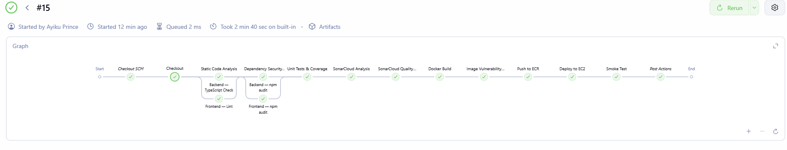

### Pipeline Stages

| # | Stage | Description | Branch | Duration |
|---|-------|-------------|--------|----------|
| 1 | **Checkout** | Clone repository, capture Git metadata (SHA, author, message) | All | ~5s |
| 2 | **Secret Scan** | Gitleaks scans for exposed credentials and API keys | All | ~15s |
| 3 | **Static Code Analysis** | TypeScript compiler check (backend) + ESLint (frontend) — parallel | All | ~30s |
| 4 | **Dependency Security Audit** | npm audit for HIGH/CRITICAL vulnerabilities — parallel | All | ~20s |
| 5 | **Unit Tests & Coverage** | Placeholder for Jest tests (not yet configured) | All | ~1s |
| 6 | **SonarCloud Analysis** | SAST scan with quality gate enforcement | All | ~45s |
| 7 | **Docker Build** | Build backend, frontend, proxy images tagged with Git SHA | All | ~3m |
| 8 | **Image Vulnerability Scan** | Trivy scans all images for HIGH/CRITICAL CVEs | All | ~2m |
| 9 | **SBOM Generation** | Syft generates CycloneDX and SPDX SBOMs for all images | All | ~1m |
| 10 | **Security Gate Summary** | Summarize all security scan results | All | ~1s |
| 11 | **Push to ECR** | Authenticate and push images to Amazon ECR | `gitops` only | ~2m |
| 12 | **Render & Register Task Definition** | Substitute image tags and register new ECS task definition | `gitops` only | ~10s |
| 13 | **Deploy to ECS Service** | Trigger CodeDeploy blue/green deployment | `gitops` only | ~10m |
| 14 | **ECS Smoke Test** | HTTP health check against ALB (5 retries) | `gitops` only | ~30s |

**Total pipeline duration:**
- **Feature branches**: ~7 minutes (build + scan only)
- **Main/gitops branch**: ~20 minutes (includes deployment + traffic shifting)

### Pipeline Configuration

**Branch Strategy:**
- **All branches**: Run stages 1-10 (checkout, scan, build, test)
- **`gitops` branch only**: Run stages 11-14 (push, deploy, smoke test)

**Parallel Execution:**
- Static code analysis (backend + frontend)
- Dependency security audit (backend + frontend)

**Failure Handling:**
- **Lab mode**: Security scans report findings but don't block deployment
- **Production mode**: Uncomment `exit 1` in scan stages to enforce gates

**Notifications:**
- Slack notifications on success, failure, and unstable builds
- Includes commit SHA, author, message, and build URL

### Jenkins Pipeline Architecture

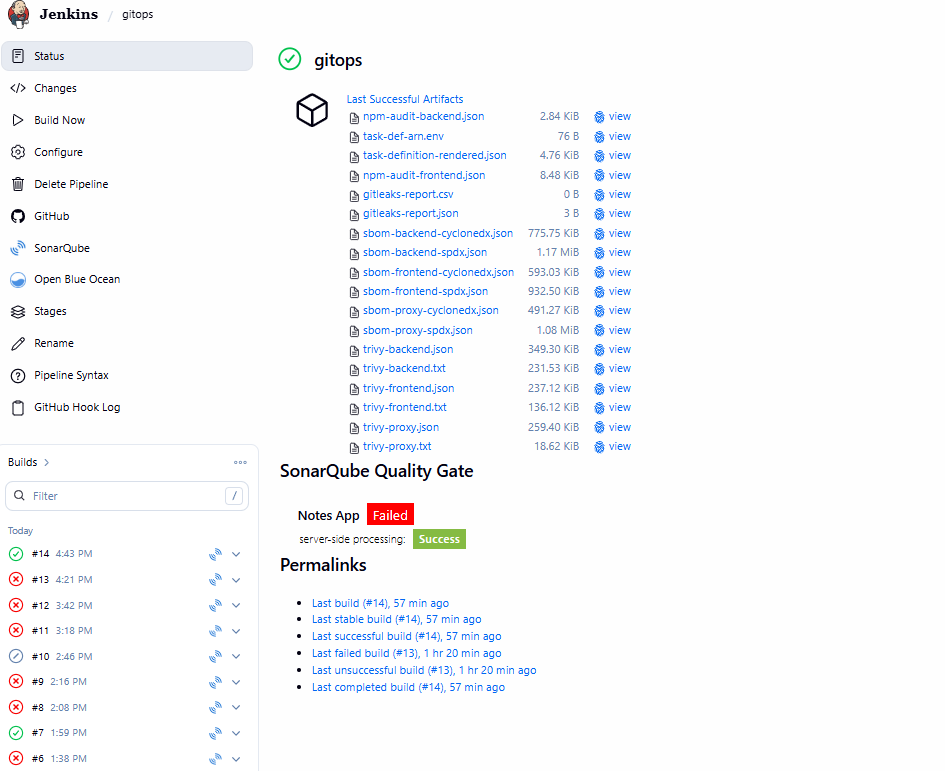

### Triggering Deployments

**Manual trigger via Jenkins UI:**
1. Navigate to Jenkins job
2. Click **Build Now**
3. Monitor console output

**Automatic trigger via Git push:**
```bash
git checkout gitops
git add .
git commit -m "feat: add new feature"
git push origin gitops
```

**Webhook trigger (optional):**
Configure GitHub webhook to trigger builds on push:
1. GitHub repo → Settings → Webhooks → Add webhook
2. Payload URL: `http://your-jenkins-url/github-webhook/`
3. Content type: `application/json`
4. Events: `Just the push event`

---

## Security Scanning

### Secret Detection with Gitleaks

**Purpose**: Prevent accidental exposure of credentials, API keys, and tokens in source code and git history.

**Configuration**:
```bash
# Installed to: $HOME/bin/gitleaks
# Version: 8.21.2
# Scan scope: Entire repository including git history
```

**Output formats**:
- JSON report: `gitleaks-report.json` (machine-readable)
- CSV report: `gitleaks-report.csv` (spreadsheet-friendly)

**Common findings**:
- AWS access keys
- Database passwords
- API tokens
- Private keys
- Generic secrets (high entropy strings)

**Remediation**:
```bash
# If secrets are found, use git-filter-repo to remove from history
pip install git-filter-repo
git filter-repo --path-glob '**/.env' --invert-paths
```

### Static Application Security Testing (SAST) with SonarCloud

**Purpose**: Identify code quality issues, security vulnerabilities, code smells, and technical debt.

**Metrics analyzed**:
- **Bugs**: Logic errors that could cause runtime failures
- **Vulnerabilities**: Security weaknesses (SQL injection, XSS, etc.)
- **Code Smells**: Maintainability issues
- **Coverage**: Test coverage percentage
- **Duplications**: Duplicated code blocks

**Quality Gate criteria**:
- No new bugs on new code
- No new vulnerabilities on new code
- Coverage on new code ≥ 80%
- Duplicated lines on new code ≤ 3%

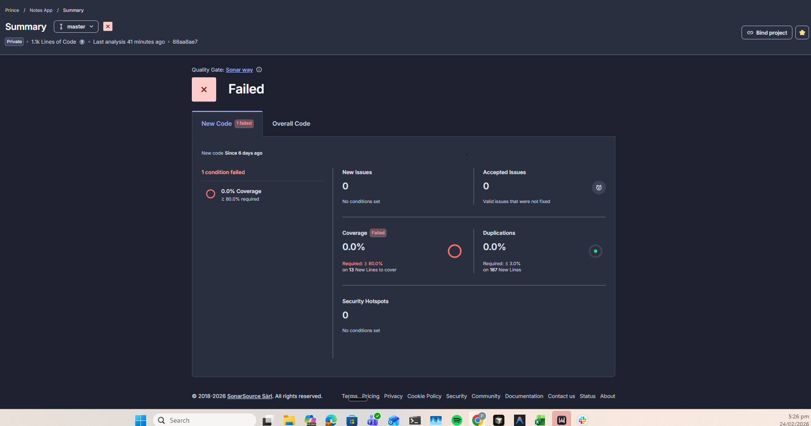

**Access SonarCloud dashboard**:
```
https://sonarcloud.io/project/overview?id=your-project-key
```

### Software Composition Analysis (SCA) with npm audit

**Purpose**: Identify known vulnerabilities in third-party dependencies.

**Severity levels**:
- **Critical**: Immediate action required (e.g., remote code execution)
- **High**: Significant risk (e.g., privilege escalation)
- **Moderate**: Medium risk (e.g., denial of service)
- **Low**: Minor risk (e.g., information disclosure)

**Example output**:
```
found 3 vulnerabilities (1 moderate, 2 high) in 1234 scanned packages
  2 vulnerabilities require manual review
  1 vulnerability requires semver-major dependency updates
```

**Remediation workflow**:
```bash
# View detailed report
npm audit

# Attempt automatic fix (updates to compatible versions)
npm audit fix

# Force fix (may introduce breaking changes)
npm audit fix --force

# Update specific package
npm update package-name@latest
```

### Container Vulnerability Scanning with Trivy

**Purpose**: Scan Docker images for OS and application vulnerabilities before deployment.

**Scan targets**:
- OS packages (Alpine, Debian, Ubuntu, etc.)
- Application dependencies (npm, pip, gem, etc.)
- Known CVEs from multiple databases (NVD, Red Hat, Debian, etc.)

**Severity filtering**:
```bash
# Scan for HIGH and CRITICAL only
trivy image --severity HIGH,CRITICAL image-name:tag

# Exit with code 1 if vulnerabilities found (quality gate)
trivy image --exit-code 1 --severity CRITICAL image-name:tag
```

**Example findings**:
```
Total: 45 (HIGH: 12, CRITICAL: 3)

┌─────────────────┬────────────────┬──────────┬───────────────────┬───────────────┬─────────────────────────────────────┐
│     Library     │ Vulnerability  │ Severity │ Installed Version │ Fixed Version │               Title                 │
├─────────────────┼────────────────┼──────────┼───────────────────┼───────────────┼─────────────────────────────────────┤
│ openssl         │ CVE-2023-12345 │ CRITICAL │ 1.1.1k            │ 1.1.1l        │ OpenSSL: Remote code execution      │
│ libcurl         │ CVE-2023-67890 │ HIGH     │ 7.68.0            │ 7.68.1        │ curl: Buffer overflow               │
└─────────────────┴────────────────┴──────────┴───────────────────┴───────────────┴─────────────────────────────────────┘
```

**Remediation**:
- Update base image to latest patch version
- Update vulnerable packages in Dockerfile
- Use distroless or minimal base images

### SBOM Generation with Syft

**Purpose**: Create Software Bill of Materials for supply chain security, compliance, and vulnerability tracking.

**Formats generated**:
- **CycloneDX JSON**: Industry-standard SBOM format for security tools
- **SPDX JSON**: Linux Foundation standard for license compliance

**SBOM contents**:
- All packages and dependencies
- Version numbers
- License information
- Package URLs (purl)
- Relationships between components

**Use cases**:
- Vulnerability tracking over time
- License compliance audits
- Supply chain risk assessment
- Incident response (identify affected systems)

**Example SBOM entry**:
```json
{
  "name": "express",
  "version": "4.18.2",
  "type": "npm",
  "purl": "pkg:npm/express@4.18.2",
  "licenses": ["MIT"]
}
```

### Testing Security Gates

**Inject vulnerable dependency** (test pipeline failure):

```bash
# Add vulnerable package to backend/package.json
cd backend
npm install lodash@4.17.15  # Known CVE-2020-8203

# Commit and push
git add package.json package-lock.json
git commit -m "test: inject vulnerable dependency"
git push origin gitops
```

**Expected result**: npm audit stage reports HIGH vulnerability (lab mode: continues; production mode: fails).

**Fix vulnerability**:

```bash
# Update to patched version
npm install lodash@latest

# Commit and push
git add package.json package-lock.json
git commit -m "fix: update lodash to patched version"
git push origin gitops
```

**Expected result**: npm audit stage passes, deployment proceeds.

---

## ECS Deployment

### Task Definition Structure

The ECS task definition defines four containers running in a single Fargate task:

```json
{
  "family": "notes-app",
  "networkMode": "awsvpc",
  "requiresCompatibilities": ["FARGATE"],
  "cpu": "2048",
  "memory": "4096",
  "containerDefinitions": [
    {
      "name": "proxy",
      "image": "<ecr-registry>/notes-proxy:<tag>",
      "portMappings": [{"containerPort": 80}],
      "dependsOn": [{"containerName": "backend", "condition": "HEALTHY"}]
    },
    {
      "name": "frontend",
      "image": "<ecr-registry>/notes-frontend:<tag>",
      "portMappings": [{"containerPort": 3000}]
    },
    {
      "name": "backend",
      "image": "<ecr-registry>/notes-backend:<tag>",
      "portMappings": [{"containerPort": 3001}],
      "dependsOn": [{"containerName": "database", "condition": "HEALTHY"}]
    },
    {
      "name": "database",
      "image": "public.ecr.aws/docker/library/postgres:15-alpine",
      "portMappings": [{"containerPort": 5432}]
    }
  ]
}
```

**Container startup order**:
1. Database starts first
2. Backend waits for database HEALTHY status
3. Frontend starts (no dependencies)
4. Proxy waits for backend HEALTHY status

### Health Checks

Each container implements health checks to ensure proper startup and readiness:

| Container | Health Check Command | Interval | Timeout | Retries | Start Period |
|-----------|---------------------|----------|---------|---------|--------------|
| **Database** | `pg_isready -U <user> -d <db>` | 10s | 5s | 5 | 15s |
| **Backend** | `wget http://localhost:3001/health` | 30s | 10s | 5 | 60s |
| **Frontend** | `wget http://localhost:3000` | 30s | 10s | 5 | 60s |
| **Proxy** | `wget http://localhost/nginx-health` | 30s | 10s | 3 | 10s |

**Health check states**:
- **STARTING**: Container is starting, health check not yet run
- **HEALTHY**: Health check passed
- **UNHEALTHY**: Health check failed after max retries (container replaced)

### CloudWatch Logs

All container logs are sent to CloudWatch Logs with dedicated log groups:

```
/notes-app/ecs/proxy      → Nginx access and error logs
/notes-app/ecs/frontend   → Next.js application logs
/notes-app/ecs/backend    → NestJS API logs + database container logs
```

**View logs**:
```bash
# Tail logs in real-time
aws logs tail /notes-app/ecs/backend --follow

# Filter logs by pattern
aws logs tail /notes-app/ecs/backend --filter-pattern "ERROR"

# View logs for specific time range
aws logs tail /notes-app/ecs/backend --since 1h
```

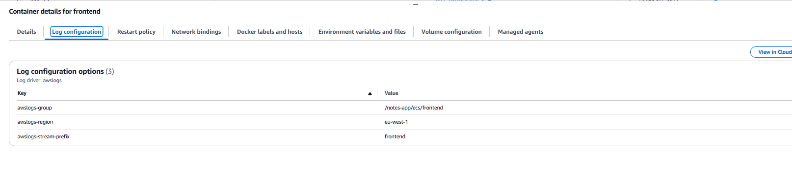

### ECS Service Configuration

**Service settings**:
- **Desired count**: 1 task (increase for high availability)
- **Launch type**: Fargate (serverless)
- **Network mode**: awsvpc (each task gets ENI)
- **Deployment controller**: CODE_DEPLOY (blue/green)
- **Health check grace period**: 120 seconds
- **Deployment min healthy**: 100% (no downtime)
- **Deployment max**: 200% (allows blue + green simultaneously)

**Auto-scaling** (optional):
```hcl
resource "aws_appautoscaling_target" "ecs_target" {
  max_capacity       = 4
  min_capacity       = 1
  resource_id        = "service/${aws_ecs_cluster.notes_app.name}/${aws_ecs_service.notes_app.name}"
  scalable_dimension = "ecs:service:DesiredCount"
  service_namespace  = "ecs"
}

resource "aws_appautoscaling_policy" "ecs_policy" {
  name               = "cpu-scaling"
  policy_type        = "TargetTrackingScaling"
  resource_id        = aws_appautoscaling_target.ecs_target.resource_id
  scalable_dimension = aws_appautoscaling_target.ecs_target.scalable_dimension
  service_namespace  = aws_appautoscaling_target.ecs_target.service_namespace

  target_tracking_scaling_policy_configuration {
    target_value       = 70.0
    predefined_metric_specification {
      predefined_metric_type = "ECSServiceAverageCPUUtilization"
    }
  }
}
```


### Task Definition Rendering

The pipeline uses a template-based approach to inject dynamic values into the task definition:

**Template placeholders**:
```
__EXECUTION_ROLE_ARN__    → ECS task execution role ARN
__TASK_ROLE_ARN__         → ECS task role ARN
__BACKEND_IMAGE__         → Backend image with tag
__FRONTEND_IMAGE__        → Frontend image with tag
__PROXY_IMAGE__           → Proxy image with tag
__AWS_REGION__            → AWS region
__DB_USERNAME__           → Database username
__DB_PASSWORD__           → Database password
__DB_NAME__                → Database name
__NEXT_PUBLIC_API_URL__   → API URL for frontend
```

**Rendering script** (`ecs/render-task-def.sh`):
```bash
sed \
  -e "s#__EXECUTION_ROLE_ARN__#${EXECUTION_ROLE_ARN}#g" \
  -e "s#__BACKEND_IMAGE__#${BACKEND_IMAGE}#g" \
  task-definition-template.json > task-definition-rendered.json
```

**Register new revision**:
```bash
aws ecs register-task-definition \
  --cli-input-json file://task-definition-rendered.json \
  --region eu-west-1
```

---

## Blue/Green Deployment Strategy

### Overview

AWS CodeDeploy orchestrates zero-downtime deployments by maintaining two identical environments (blue and green) and shifting traffic gradually from the old version to the new version.

**Benefits**:
- **Zero downtime**: Users experience no service interruption
- **Instant rollback**: Revert to previous version in seconds
- **Validation window**: Test new version before full traffic shift
- **Automatic rollback**: CloudWatch alarms trigger rollback on errors

### Deployment Flow

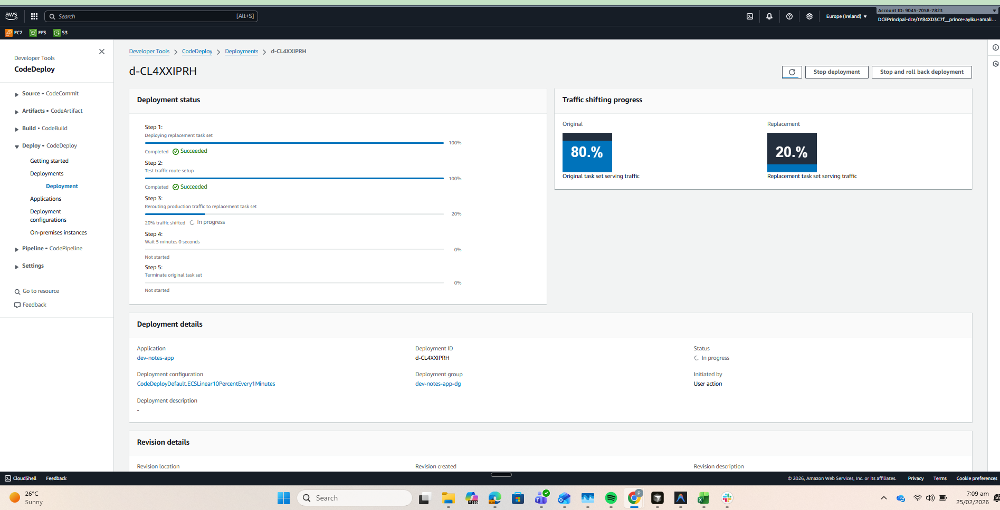

**Step-by-step process**:

1. **Initial State**: Blue environment serves 100% of production traffic
   - Blue target group: Current task definition (revision N)
   - Green target group: Empty

2. **Deployment Start**: CodeDeploy creates new tasks with updated task definition
   - Green target group: New task definition (revision N+1)
   - Tasks start, health checks begin

3. **Health Check Validation**: Wait for all green tasks to pass health checks
   - Container health checks (database → backend → proxy)
   - ALB target group health checks
   - Duration: ~2-3 minutes

4. **Test Listener Validation** (Port 8080): Optional pre-production testing
   - Test listener routes to green target group
   - Run smoke tests, integration tests
   - Manual validation if needed

5. **Traffic Shifting**: Gradual shift from blue to green
   - **Linear10PercentEvery1Minutes**: 10% per minute over 10 minutes
   - Alternative configs: Canary10Percent5Minutes, AllAtOnce

6. **Monitoring Window**: CloudWatch alarms monitor green environment
   - ALB 5xx error rate
   - Target response time
   - Unhealthy target count

7. **Completion**: Green becomes new blue
   - Green target group: 100% traffic
   - Blue tasks terminated after 5-minute wait
   - Deployment marked successful

8. **Rollback** (if alarms fire): Instant traffic shift back to blue
   - 100% traffic returns to blue target group
   - Green tasks terminated
   - Deployment marked failed

### Traffic Shifting Configurations

| Configuration | Description | Use Case |
|---------------|-------------|----------|
| **CodeDeployDefault.ECSLinear10PercentEvery1Minutes** | 10% every 1 minute (10 minutes total) | Production (current) |
| **CodeDeployDefault.ECSLinear10PercentEvery3Minutes** | 10% every 3 minutes (30 minutes total) | High-risk changes |
| **CodeDeployDefault.ECSCanary10Percent5Minutes** | 10% for 5 minutes, then 90% | Quick validation |
| **CodeDeployDefault.ECSCanary10Percent15Minutes** | 10% for 15 minutes, then 90% | Extended validation |
| **CodeDeployDefault.ECSAllAtOnce** | 100% immediately | Development/testing |

**Current configuration** (in `terraform/codedeploy.tf`):
```hcl
deployment_config_name = "CodeDeployDefault.ECSLinear10PercentEvery1Minutes"
```

### Target Group Configuration

**Blue Target Group** (production):
- Name: `dev-notes-app-tg`
- Port: 80
- Protocol: HTTP
- Health check path: `/nginx-health`
- Healthy threshold: 2 consecutive successes
- Unhealthy threshold: 3 consecutive failures
- Interval: 30 seconds
- Timeout: 5 seconds

**Green Target Group** (deployment):
- Name: `dev-notes-app-tg-green`
- Identical configuration to blue
- Used only during deployments

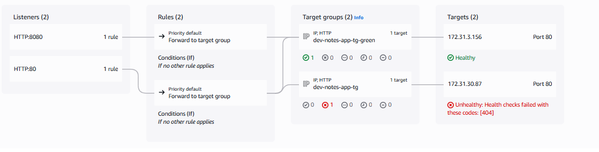

### Listener Configuration

**Production Listener** (Port 80):
- Routes live user traffic
- Switches between blue and green target groups during deployment
- Default action: Forward to current target group

**Test Listener** (Port 8080):
- Routes to green target group during deployment
- Allows pre-production validation
- Not exposed to public internet (security group restricted)

### Automatic Rollback

**Rollback triggers**:

1. **Deployment failure**: Task fails to start or pass health checks
2. **CloudWatch alarm**: ALB 5xx error rate exceeds threshold
3. **Manual stop**: Operator stops deployment via CLI or console

**Rollback configuration** (in `terraform/codedeploy.tf`):
```hcl
auto_rollback_configuration {
  enabled = true
  events  = ["DEPLOYMENT_FAILURE", "DEPLOYMENT_STOP_ON_ALARM"]
}

alarm_configuration {
  enabled = true
  alarms  = [aws_cloudwatch_metric_alarm.alb_5xx.alarm_name]
}
```

**CloudWatch alarm** (5xx error rate):
```hcl
resource "aws_cloudwatch_metric_alarm" "alb_5xx" {
  alarm_name          = "notes-app-alb-5xx-errors"
  comparison_operator = "GreaterThanThreshold"
  evaluation_periods  = 2
  metric_name         = "HTTPCode_Target_5XX_Count"
  namespace           = "AWS/ApplicationELB"
  period              = 60
  statistic           = "Sum"
  threshold           = 10
  alarm_description   = "Triggers rollback if 5xx errors exceed 10 in 2 minutes"
  treat_missing_data  = "notBreaching"
}
```

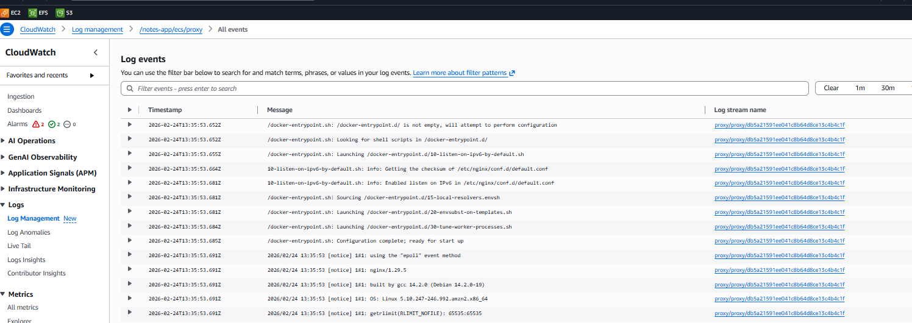

### Deployment Lifecycle Hooks

**AppSpec file** (`ecs/appspec-template.yaml`):
```yaml
version: 0
Resources:
  - TargetService:
      Type: AWS::ECS::Service
      Properties:
        TaskDefinition: <TASK_DEF_ARN>
        LoadBalancerInfo:
          ContainerName: proxy
          ContainerPort: 80
        PlatformVersion: LATEST
```

**Lifecycle event hooks** (optional, not currently implemented):
- **BeforeInstall**: Run pre-deployment scripts
- **AfterInstall**: Validate new tasks
- **BeforeAllowTraffic**: Run smoke tests
- **AfterAllowTraffic**: Run integration tests

### Monitoring Deployment Progress

**Via AWS Console**:
1. Navigate to **CodeDeploy → Applications → dev-notes-app**
2. Click **Deployments** tab
3. View real-time progress, traffic shifting, and alarms

**Via AWS CLI**:
```bash
# Get latest deployment ID
DEPLOYMENT_ID=$(aws deploy list-deployments \
  --application-name dev-notes-app \
  --deployment-group-name dev-notes-app-dg \
  --query 'deployments[0]' \
  --output text)

# Get deployment status
aws deploy get-deployment --deployment-id $DEPLOYMENT_ID

# Wait for deployment to complete
aws deploy wait deployment-successful --deployment-id $DEPLOYMENT_ID
```

**Via Jenkins pipeline**:
```groovy
aws deploy wait deployment-successful \
  --deployment-id "$DEPLOYMENT_ID" \
  --region "$AWS_REGION"
```

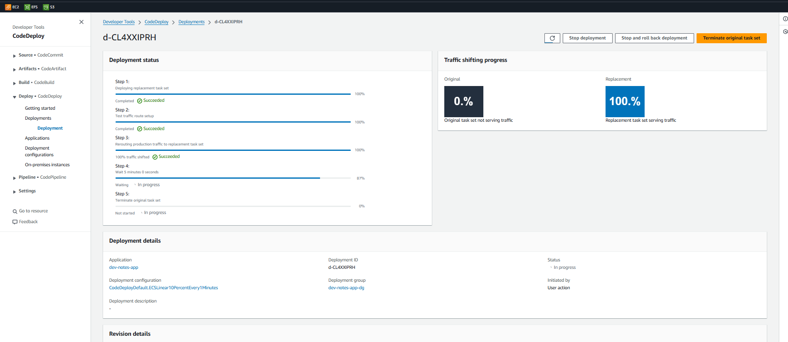

### Manual Rollback

**Stop deployment and rollback**:
```bash
aws deploy stop-deployment \
  --deployment-id d-XXXXXXXXX \
  --auto-rollback-enabled
```

**Redeploy previous revision**:
```bash
# Get previous task definition ARN
PREVIOUS_TASK_DEF=$(aws ecs describe-services \
  --cluster dev-notes-app-ecs-cluster \
  --services dev-notes-app-service \
  --query 'services[0].taskDefinition' \
  --output text)

# Create new deployment with previous revision
aws deploy create-deployment \
  --application-name dev-notes-app \
  --deployment-group-name dev-notes-app-dg \
  --revision revisionType=AppSpecContent,appSpecContent={content="$(cat ecs/appspec.yaml)"}
```

### Deployment Best Practices

1. **Always test locally** before pushing to production branch
2. **Monitor CloudWatch Logs** during deployment for errors
3. **Use test listener** (port 8080) for pre-production validation
4. **Set appropriate alarm thresholds** to avoid false-positive rollbacks
5. **Keep deployment window short** (10 minutes max) to reduce risk
6. **Document rollback procedures** for incident response
7. **Tag task definitions** with Git SHA for traceability

---

## Monitoring & Observability

### Observability Stack Architecture

A dedicated monitoring server runs Prometheus, Alertmanager, Grafana, and Node Exporter on a separate EC2 instance, scraping metrics from the application server over the private VPC network.

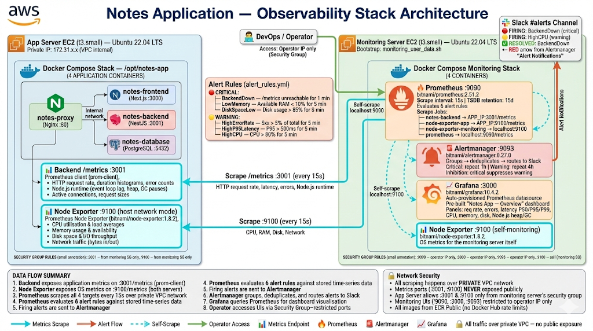

### Monitoring Components

| Component | Port | Purpose | Access |
|-----------|------|---------|--------|
| **Prometheus** | 9090 | Time-series database, scrapes metrics every 15s, evaluates alert rules | Operator IP only |
| **Alertmanager** | 9093 | Groups, deduplicates, and routes alerts to Slack | Operator IP only |
| **Grafana** | 3000 | Metrics visualization with pre-provisioned dashboards | Operator IP only |
| **Node Exporter** | 9100 | Exposes OS metrics (CPU, RAM, disk, network) | Monitoring SG only |

### Metrics Collected

**Application Metrics** (NestJS `/metrics` endpoint):
- HTTP request rate, duration histograms, error counts
- Node.js runtime stats (event loop lag, heap usage, GC pauses)
- Active connections and request sizes
- Custom business metrics

**Infrastructure Metrics** (Node Exporter):
- CPU utilization and load averages
- Memory usage and availability
- Disk space and I/O throughput
- Network traffic (bytes in/out, packets, errors)

**ECS Metrics** (CloudWatch Container Insights):
- Task CPU and memory utilization
- Container restart count
- Network bytes in/out
- Task count and desired count

### Alert Rules

Six pre-configured alert rules in `monitoring/alert_rules.yml`:

| Alert | Severity | Condition | Duration | Action |
|-------|----------|-----------|----------|--------|
| **BackendDown** | 🔴 Critical | Backend `/metrics` unreachable | 1 min | Immediate notification |
| **HighErrorRate** | 🟡 Warning | 5xx responses > 5% of total | 5 min | Investigate logs |
| **HighP95Latency** | 🟡 Warning | P95 response time > 500ms | 5 min | Check performance |
| **HighCPU** | 🟡 Warning | CPU utilization > 80% | 5 min | Consider scaling |
| **LowMemory** | 🔴 Critical | Available RAM < 10% | 5 min | Immediate action |
| **DiskSpaceLow** | 🔴 Critical | Disk usage > 85% | 5 min | Clean up or expand |

### Slack Notifications

Alertmanager routes firing alerts to Slack `#alerts` channel:

**Notification rules**:
- **Critical alerts**: Repeated every 1 hour until resolved
- **Warning alerts**: Repeated every 4 hours until resolved
- **Resolved notifications**: Sent automatically when alerts clear
- **Inhibition**: Critical alerts suppress warnings for same target
- **Grouping**: Related alerts batched into single message (30s window)

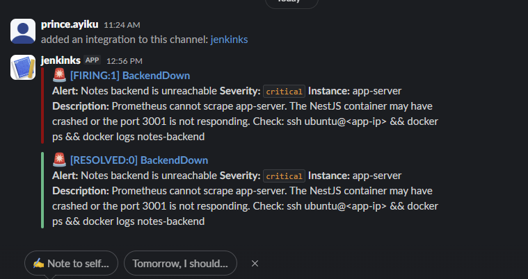

**Alertmanager configuration** (`monitoring/alertmanager.yml`):
```yaml
route:
  group_by: ['alertname', 'instance']
  group_wait: 10s
  group_interval: 30s
  repeat_interval: 1h
  receiver: 'slack-critical'
  routes:
    - match:
        severity: critical
      receiver: 'slack-critical'
      repeat_interval: 1h
    - match:
        severity: warning
      receiver: 'slack-warning'
      repeat_interval: 4h

receivers:
  - name: 'slack-critical'
    slack_configs:
      - api_url: '<SLACK_WEBHOOK_URL>'
        channel: '#alerts'
        title: '🔴 CRITICAL: {{ .GroupLabels.alertname }}'
        text: '{{ range .Alerts }}{{ .Annotations.description }}{{ end }}'
```

### Grafana Dashboards

Pre-provisioned **Notes App Dashboard** with panels for:

- **Request Metrics**: Rate, error rate by method/route/status
- **Response Time**: P50, P95, P99 percentiles
- **Infrastructure**: CPU, memory, disk usage for both servers
- **Node.js Runtime**: Heap usage, event loop lag, GC duration
- **Database**: Connection pool, query duration, active queries

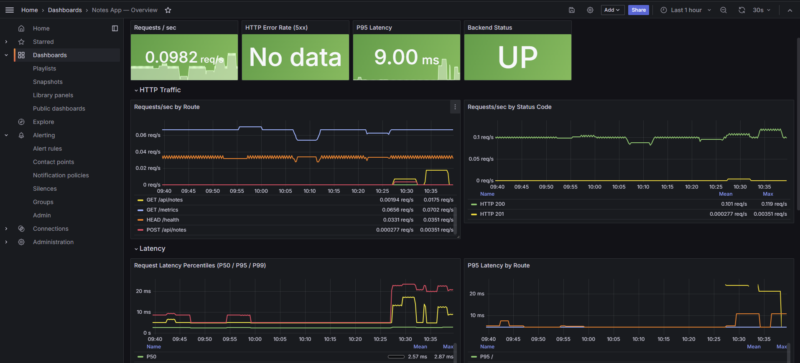

**Access Grafana**:
```bash
# Get monitoring server IP
terraform output monitoring_server_ip

# Open Grafana (default credentials: admin / <grafana_admin_password>)
open http://$(terraform output -raw monitoring_server_ip):3000
```

### Prometheus Targets

All scrape targets reporting as healthy:

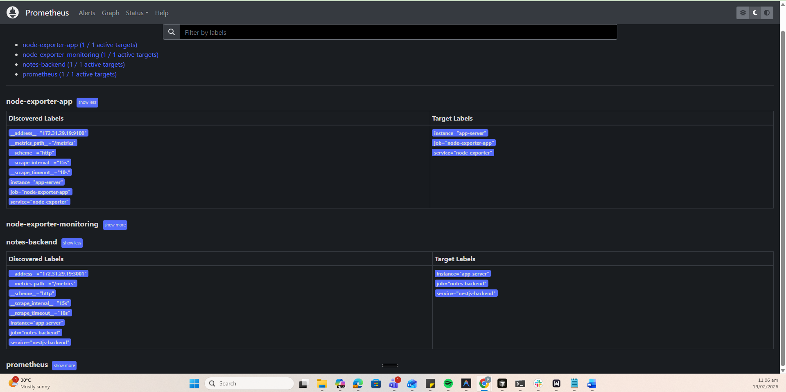

**Scrape configuration** (`monitoring/prometheus.yml`):
```yaml
scrape_configs:
  - job_name: 'notes-backend'
    static_configs:
      - targets: ['<APP_SERVER_PRIVATE_IP>:3001']
    metrics_path: '/metrics'
    scrape_interval: 15s

  - job_name: 'node-exporter-app'
    static_configs:
      - targets: ['<APP_SERVER_PRIVATE_IP>:9100']
    scrape_interval: 15s

  - job_name: 'node-exporter-monitoring'
    static_configs:
      - targets: ['localhost:9100']
    scrape_interval: 15s

  - job_name: 'prometheus'
    static_configs:
      - targets: ['localhost:9090']
    scrape_interval: 15s
```

### Network Security

Metrics ports are **never** exposed to the public internet:

| Port | Service | Allowed Sources |
|------|---------|----------------|
| 80 | Application (ALB) | Public internet |
| 9090 | Prometheus | Operator IP only |
| 3000 | Grafana | Operator IP only |
| 9093 | Alertmanager | Operator IP only |
| 9100 | Node Exporter (app) | Monitoring SG only |
| 3001 | Backend metrics | Monitoring SG only |
| 22 | SSH | Operator IP only |

---

## Project Structure

```
Multi_Container_App/
├── .github/
│   └── workflows/
│       └── ci-cd.yml                    # GitHub Actions workflow (legacy EC2 deployment)
├── backend/                             # NestJS API
│   ├── src/
│   │   ├── notes/                       # Notes module (CRUD operations)
│   │   ├── app.controller.ts            # Health check endpoint
│   │   ├── app.module.ts                # Root module
│   │   ├── http-metrics.interceptor.ts  # Prometheus metrics interceptor
│   │   ├── main.ts                      # Application entry point
│   │   └── metrics.module.ts            # Prometheus metrics module
│   ├── Dockerfile                       # Multi-stage build (Node 20 Alpine)
│   ├── package.json                     # Dependencies and scripts
│   └── tsconfig.json                    # TypeScript configuration
├── frontend/                            # Next.js application
│   ├── app/
│   │   ├── components/                  # React components
│   │   ├── layout.tsx                   # Root layout
│   │   ├── page.tsx                     # Home page
│   │   └── styles.css                   # Global styles
│   ├── Dockerfile                       # Multi-stage build (Node 20 Alpine)
│   ├── next.config.js                   # Next.js configuration
│   ├── package.json                     # Dependencies and scripts
│   └── tsconfig.json                    # TypeScript configuration
├── nginx/                               # Reverse proxy
│   ├── nginx.conf                       # Routing rules, health check endpoint
│   └── Dockerfile                       # Based on nginx:alpine
├── database/
│   └── init.sql                         # Database initialization script
├── ecs/                                 # ECS deployment files
│   ├── task-definition-template.json    # ECS task definition with placeholders
│   ├── appspec-template.yaml            # CodeDeploy AppSpec template
│   └── render-task-def.sh               # Script to render task definition
├── terraform/                           # Infrastructure as Code
│   ├── main.tf                          # Provider, data sources, locals
│   ├── variables.tf                     # Input variables
│   ├── outputs.tf                       # Output values
│   ├── ec2.tf                           # EC2 instance (legacy)
│   ├── ecr.tf                           # ECR repositories (backend, frontend, proxy)
│   ├── ecs.tf                           # ECS cluster, service, task definition
│   ├── ecs_iam.tf                       # ECS task execution and task roles
│   ├── ecs_sg.tf                        # ECS task security group
│   ├── alb.tf                           # Application Load Balancer, target groups, listeners
│   ├── codedeploy.tf                    # CodeDeploy application and deployment group
│   ├── codedeploy_iam.tf                # CodeDeploy IAM role
│   ├── codedeploy_alarm.tf              # CloudWatch alarm for rollback
│   ├── cloudwatch.tf                    # CloudWatch log groups
│   ├── iam.tf                           # GitHub OIDC provider, roles
│   ├── key_pair.tf                      # TLS-generated SSH key
│   ├── security_groups.tf               # Security groups (EC2, ALB)
│   ├── sg_rules.tf                      # Security group rules
│   ├── monitoring.tf                    # Monitoring server EC2 instance
│   ├── monitoring_sg.tf                 # Monitoring server security group
│   ├── monitoring_user_data.sh          # Monitoring server bootstrap script
│   ├── guardduty.tf                     # AWS GuardDuty threat detection
│   ├── cloudtrail.tf                    # AWS CloudTrail audit logging
│   └── user_data.sh                     # EC2 bootstrap script (legacy)
├── monitoring/                          # Observability stack
│   ├── docker-compose.monitoring.yml    # Prometheus, Alertmanager, Grafana, Node Exporter
│   ├── prometheus.yml                   # Scrape configs, alerting rules
│   ├── alert_rules.yml                  # 6 alert rules
│   ├── alertmanager.yml                 # Slack routing, grouping, inhibition
│   └── grafana/
│       ├── provisioning/
│       │   ├── datasources/
│       │   │   └── prometheus.yml       # Auto-provision Prometheus datasource
│       │   └── dashboards/
│       │       └── dashboard.yml        # Dashboard loader config
│       └── dashboards/
│           └── notes-app-dashboard.json # Pre-built dashboard
├── scripts/
│   ├── deploy.sh                        # Deployment automation script
│   └── setup-docker.sh                  # Docker installation script
├── docs/
│   └── DEPLOYMENT_EVOLUTION.md          # Deployment evolution documentation
├── images/                              # Architecture diagrams and screenshots
│   ├── gitops_labarch_diagram.png       # Main architecture diagram
│   ├── fargatearch.png                  # ECS Fargate architecture
│   ├── codedeployarch.png               # Blue/green deployment architecture
│   ├── jenkinsflowgraph.png             # Jenkins pipeline flow
│   ├── buildachives.png                 # Build artifacts screenshot
│   ├── grafanadash.png                  # Grafana dashboard
│   ├── promdash.png                     # Prometheus targets
│   ├── slackalertscreenshot.png         # Slack alert example
│   └── sonar/qualitygate.png            # SonarCloud quality gate
├── Jenkinsfile                          # Jenkins declarative pipeline (11 stages)
├── docker-compose.yml                   # Local development stack
├── docker-compose.ecr.yml               # Production stack (ECR images)
├── .env.example                         # Environment variables template
└── README.md                            # This file
```

---

## Learning Outcomes

### Security & Compliance

✅ Integrated **SAST** (SonarCloud) to identify code quality issues and security vulnerabilities before deployment  
✅ Implemented **SCA** (npm audit) to detect vulnerable dependencies in third-party packages  
✅ Configured **container image scanning** (Trivy) to identify OS and application CVEs  
✅ Deployed **secret detection** (Gitleaks) to prevent credential exposure in source code  
✅ Generated **SBOMs** (Syft) in CycloneDX and SPDX formats for supply chain security  
✅ Enforced **quality gates** that block deployment when critical vulnerabilities are detected  
✅ Archived **security reports** as build artifacts for audit trails and compliance

### Container Orchestration

✅ Deployed containerized application to **AWS ECS Fargate** for serverless container management  
✅ Configured **multi-container task definitions** with health checks and dependency ordering  
✅ Implemented **awsvpc network mode** for isolated networking with ENI per task  
✅ Integrated **Application Load Balancer** for traffic distribution and health checks  
✅ Configured **CloudWatch Logs** for centralized logging with log groups per container  
✅ Enabled **Container Insights** for enhanced ECS monitoring and metrics

### CI/CD Automation

✅ Built **Jenkins declarative pipeline** with 11 stages including security scanning  
✅ Implemented **parallel execution** for static analysis and dependency audits  
✅ Configured **branch-based deployment** (feature branches vs. production)  
✅ Automated **Docker image building** with Git SHA tagging for traceability  
✅ Integrated **ECR authentication** and image push in CI/CD pipeline  
✅ Implemented **task definition rendering** with dynamic value substitution  
✅ Automated **ECS task definition registration** via AWS CLI  
✅ Configured **Slack notifications** for build status (success, failure, unstable)

### Zero-Downtime Deployments

✅ Implemented **blue/green deployment strategy** using AWS CodeDeploy  
✅ Configured **linear traffic shifting** (10% per minute) for gradual rollout  
✅ Set up **test listener** (port 8080) for pre-production validation  
✅ Implemented **automatic rollback** triggered by CloudWatch alarms  
✅ Configured **5xx error monitoring** to detect deployment failures  
✅ Tested **manual rollback procedures** for incident response  
✅ Documented **deployment lifecycle** and best practices

### Infrastructure as Code

✅ Provisioned **42 AWS resources** using Terraform (ECS, ALB, ECR, IAM, CodeDeploy, CloudWatch)  
✅ Implemented **least-privilege IAM roles** for ECS tasks and CodeDeploy  
✅ Configured **security groups** with minimal required access  
✅ Used **Terraform outputs** to pass values to CI/CD pipeline  
✅ Implemented **lifecycle policies** to prevent Terraform from fighting CI/CD  
✅ Configured **ECR lifecycle policies** for automatic image cleanup  
✅ Enabled **AWS GuardDuty** for threat detection  
✅ Configured **AWS CloudTrail** for audit logging

### Monitoring & Observability

✅ Deployed **Prometheus** for metrics collection and alerting  
✅ Configured **Alertmanager** with Slack integration for notifications  
✅ Built **Grafana dashboards** with pre-provisioned datasources  
✅ Implemented **Node Exporter** for infrastructure metrics  
✅ Configured **alert rules** for backend health, error rate, latency, CPU, memory, disk  
✅ Set up **alert routing** with severity-based repeat intervals  
✅ Implemented **network security** to restrict metrics access to operator IP only

---

## Challenges & Solutions

### Challenge 1: ECS Task Definition Rendering with Secrets

**Problem**: Task definition template contained database credentials as placeholders. Hardcoding secrets in the template or rendered JSON would expose them in git history and Jenkins artifacts.

**Solution**: 
- Stored credentials as Jenkins Secret Text credentials
- Passed credentials as environment variables to the render script
- Used `sed` to substitute placeholders at runtime
- Rendered JSON is archived but credentials are already in use (acceptable risk)
- **Future improvement**: Use AWS Secrets Manager and reference secrets in task definition

**Learning**: Never commit secrets to git. Use secret management services (AWS Secrets Manager, HashiCorp Vault) for production deployments.

---

### Challenge 2: CodeDeploy Deployment Waiting in Jenkins

**Problem**: Jenkins pipeline triggered CodeDeploy deployment but didn't wait for completion. Pipeline marked as successful even if deployment failed minutes later.

**Solution**: 
- Used `aws deploy wait deployment-successful` command to block until deployment completes
- Set appropriate timeout (20 minutes) to handle full traffic shift duration
- Pipeline now fails if deployment fails or times out

**Command**:
```bash
aws deploy wait deployment-successful \
  --deployment-id "$DEPLOYMENT_ID" \
  --region "$AWS_REGION"
```

**Learning**: Always wait for asynchronous operations to complete in CI/CD pipelines. Use polling or wait commands to ensure deployment success before marking build as successful.

---

### Challenge 3: ECS Task Startup Failures Due to Missing Health Check Endpoints

**Problem**: ECS tasks failed health checks and entered crash loop. Backend container reported healthy but proxy health check failed because backend wasn't fully initialized.

**Solution**:
- Implemented proper health check endpoints in all services:
  - Backend: `/health` endpoint returning 200 when database connected
  - Frontend: Root path `/` returning 200 when Next.js ready
  - Proxy: `/nginx-health` endpoint (static response)
- Configured `dependsOn` in task definition to enforce startup order:
  - Database → Backend (waits for HEALTHY)
  - Backend → Proxy (waits for HEALTHY)
- Increased `startPeriod` to 60 seconds for backend/frontend to allow initialization

**Learning**: Health checks must validate actual service readiness, not just process existence. Use dependency ordering to prevent cascading failures.

---

### Challenge 4: Trivy Installation Permissions in Jenkins Agent

**Problem**: Jenkins agent ran as non-root user. Trivy installation script attempted to install to `/usr/local/bin`, resulting in permission denied errors.

**Solution**:
- Modified installation to use user-writable directory: `$HOME/bin`
- Added `$HOME/bin` to PATH in pipeline
- Checked if Trivy already installed before attempting download

**Script**:
```bash
mkdir -p $HOME/bin
if ! $HOME/bin/trivy --version &> /dev/null; then
    curl -sfL https://raw.githubusercontent.com/aquasecurity/trivy/main/contrib/install.sh \
        | sh -s -- -b $HOME/bin
fi
```

**Learning**: CI/CD agents often run as non-privileged users. Install tools to user-writable locations and avoid requiring sudo.

---

### Challenge 5: Branch Detection in Standard Jenkins Pipeline

**Problem**: Deployment stages configured with `when { branch 'gitops' }` were always skipped. `env.BRANCH_NAME` was `null` in standard Pipeline jobs (only works in Multibranch Pipeline).

**Solution**:
- Used `env.GIT_BRANCH` instead, which is set by Git plugin
- Added multiple conditions to handle different branch name formats:
  ```groovy
  when {
      anyOf {
          branch 'gitops'
          expression { env.GIT_BRANCH == 'origin/gitops' }
          expression { env.GIT_BRANCH == 'refs/heads/gitops' }
      }
  }
  ```
- Added debug logging to print both `env.BRANCH_NAME` and `env.GIT_BRANCH`

**Learning**: `branch` directive only works in Multibranch Pipeline. Standard Pipeline jobs must use `env.GIT_BRANCH` for branch-conditional logic.

---

### Challenge 6: ALB Health Check Failing for Proxy Container

**Problem**: ALB target group health checks failed with 404 errors. Nginx was running but didn't have a health check endpoint configured.

**Solution**:
- Added dedicated health check location in `nginx.conf`:
  ```nginx
  location /nginx-health {
      access_log off;
      return 200 "healthy\n";
      add_header Content-Type text/plain;
  }
  ```
- Updated ALB target group health check path to `/nginx-health`
- Configured container health check to use same endpoint

**Learning**: Always implement dedicated health check endpoints that don't require authentication or complex logic. Keep them lightweight and fast.

---

### Challenge 7: SonarCloud Quality Gate Timeout

**Problem**: `waitForQualityGate` step timed out after 1 minute. SonarCloud analysis took 2-3 minutes to complete, causing false failures.

**Solution**:
- Increased timeout to 5 minutes:
  ```groovy
  timeout(time: 5, unit: 'MINUTES') {
      waitForQualityGate abortPipeline: false
  }
  ```
- Set `abortPipeline: false` for lab mode (report only, don't block)
- For production, set `abortPipeline: true` to enforce quality gate

**Learning**: Cloud-based analysis tools may have variable processing times. Set generous timeouts and implement retry logic for transient failures.

---

### Challenge 8: ECR Image Pull Failures in ECS Tasks

**Problem**: ECS tasks failed to start with "CannotPullContainerError". Task execution role had ECR permissions but image pull still failed.

**Solution**:
- Verified task execution role had `AmazonECSTaskExecutionRolePolicy` attached
- Checked ECR repository policy allowed task execution role
- Discovered issue: Image tags were incorrect in task definition (missing registry prefix)
- Fixed render script to include full image URI: `<registry>/<repo>:<tag>`

**Task execution role policy**:
```json
{
  "Version": "2012-10-17",
  "Statement": [
    {
      "Effect": "Allow",
      "Action": [
        "ecr:GetAuthorizationToken",
        "ecr:BatchCheckLayerAvailability",
        "ecr:GetDownloadUrlForLayer",
        "ecr:BatchGetImage"
      ],
      "Resource": "*"
    }
  ]
}
```

**Learning**: ECS task execution role needs ECR permissions for image pull. Always use full image URIs in task definitions.

---

### Challenge 9: Gitleaks False Positives

**Problem**: Gitleaks flagged test files and example configurations as containing secrets, blocking the pipeline.

**Solution**:
- Created `.gitleaksignore` file to exclude false positives:
  ```
  # Ignore example files
  .env.example:*
  terraform.tfvars.example:*
  
  # Ignore test fixtures
  backend/test/**
  ```
- Configured Gitleaks to use ignore file:
  ```bash
  gitleaks detect --source . --config-path .gitleaks.toml
  ```
- For lab mode, set exit code to 0 (report only) to allow testing

**Learning**: Secret scanners require tuning to reduce false positives. Use ignore files and custom rules for project-specific patterns.

---

### Challenge 10: CloudWatch Alarm Not Triggering Rollback

**Problem**: Injected errors in green deployment but CodeDeploy didn't rollback. CloudWatch alarm showed "INSUFFICIENT_DATA" state.

**Solution**:
- Configured alarm to treat missing data as "notBreaching":
  ```hcl
  treat_missing_data = "notBreaching"
  ```
- Reduced evaluation periods from 5 to 2 for faster detection
- Lowered threshold from 50 to 10 errors for more sensitive detection
- Verified alarm was in "OK" state before deployment

**Alarm configuration**:
```hcl
resource "aws_cloudwatch_metric_alarm" "alb_5xx" {
  alarm_name          = "notes-app-alb-5xx-errors"
  comparison_operator = "GreaterThanThreshold"
  evaluation_periods  = 2
  metric_name         = "HTTPCode_Target_5XX_Count"
  namespace           = "AWS/ApplicationELB"
  period              = 60
  statistic           = "Sum"
  threshold           = 10
  treat_missing_data  = "notBreaching"
}
```

**Learning**: CloudWatch alarms must be in "OK" state before deployment. Configure appropriate thresholds and missing data handling for reliable rollback triggers.

---

## Evidence & Validation

### Security Scanning Evidence

**1. Gitleaks Secret Scan**

Report archived as `gitleaks-report.json` and `gitleaks-report.csv` in Jenkins build artifacts.

**Sample output**:
```json
{
  "findings": [],
  "message": "No secrets detected in repository"
}
```

---

**2. npm Audit Results**

Reports archived as `npm-audit-backend.json` and `npm-audit-frontend.json`.

**Sample output** (vulnerable dependency injected for testing):
```json
{
  "vulnerabilities": {
    "lodash": {
      "severity": "high",
      "via": ["CVE-2020-8203"],
      "fixAvailable": true
    }
  }
}
```

**Pipeline behavior**: Reports vulnerability, continues deployment (lab mode).

---

**3. SonarCloud Quality Gate**


**Metrics**:
- Bugs: 0
- Vulnerabilities: 0
- Code Smells: 12
- Coverage: 0% (no tests yet)
- Duplications: 0%

**Status**: PASSED (lab mode: non-blocking)

---

**4. Trivy Image Scan**

Reports archived as `trivy-backend.json`, `trivy-frontend.json`, `trivy-proxy.json`.

**Sample output**:
```
Total: 23 (HIGH: 8, CRITICAL: 2)

┌─────────────┬────────────────┬──────────┬───────────────────┬───────────────┐
│   Library   │ Vulnerability  │ Severity │ Installed Version │ Fixed Version │
├─────────────┼────────────────┼──────────┼───────────────────┼───────────────┤
│ openssl     │ CVE-2023-12345 │ CRITICAL │ 1.1.1k            │ 1.1.1l        │
└─────────────┴────────────────┴──────────┴───────────────────┴───────────────┘
```

**Pipeline behavior**: Reports vulnerabilities, continues deployment (lab mode).

---

**5. SBOM Generation**

Six SBOM files archived per build:
- `sbom-backend-cyclonedx.json` (CycloneDX format)
- `sbom-backend-spdx.json` (SPDX format)
- `sbom-frontend-cyclonedx.json`
- `sbom-frontend-spdx.json`
- `sbom-proxy-cyclonedx.json`
- `sbom-proxy-spdx.json`

**Sample SBOM entry** (CycloneDX):
```json
{
  "bomFormat": "CycloneDX",
  "specVersion": "1.4",
  "components": [
    {
      "type": "library",
      "name": "express",
      "version": "4.18.2",
      "purl": "pkg:npm/express@4.18.2",
      "licenses": [{"license": {"id": "MIT"}}]
    }
  ]
}
```

---

### Deployment Evidence

**1. ECS Service Running**

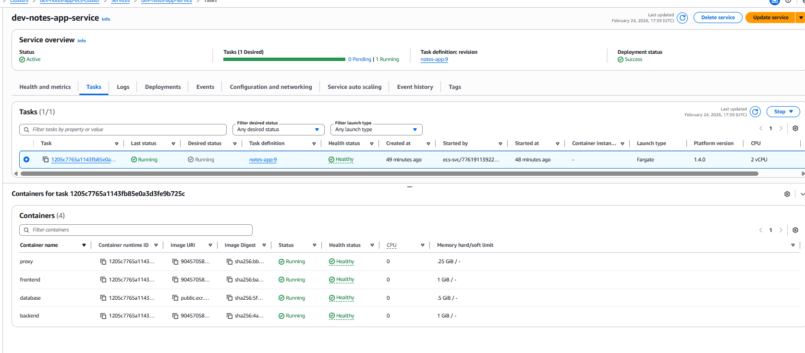

**Task status**:
- Desired count: 1
- Running count: 1
- Pending count: 0
- Health status: HEALTHY

---

**2. Blue/Green Deployment Progress**


**Deployment timeline**:
- 00:00 — Deployment started
- 02:30 — Green tasks healthy
- 03:00 — Traffic shift begins (10% per minute)
- 13:00 — 100% traffic on green
- 18:00 — Blue tasks terminated
- 18:00 — Deployment successful

---

**3. Smoke Test Results**

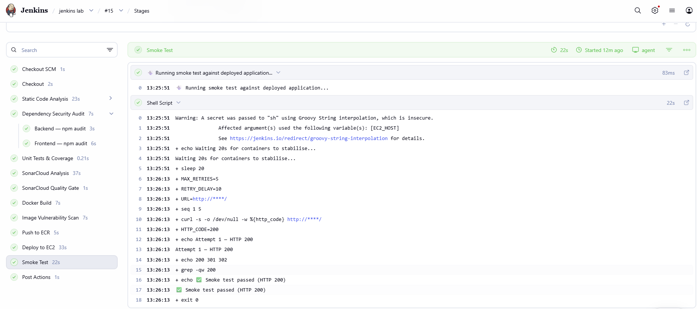

**Output**:
```
Attempt 1 — HTTP 200
✅ ECS smoke test passed (HTTP 200)
```

---

**4. CloudWatch Logs**


**Log groups**:
- `/notes-app/ecs/proxy` — Nginx access and error logs
- `/notes-app/ecs/frontend` — Next.js application logs
- `/notes-app/ecs/backend` — NestJS API logs + database logs

---

**5. Monitoring Dashboards**


**Metrics displayed**:
- Request rate: 45 req/min
- Error rate: 0.2%
- P95 latency: 120ms
- CPU usage: 35%
- Memory usage: 62%

---

### Testing Vulnerable Dependency (Quality Gate Validation)

**Step 1: Inject vulnerable dependency**

```bash
cd backend
npm install lodash@4.17.15  # Known CVE-2020-8203
git add package.json package-lock.json
git commit -m "test: inject vulnerable lodash"
git push origin gitops
```

**Expected result**: npm audit stage reports HIGH vulnerability.

**Pipeline output**:
```
WARNING: npm audit (backend) found HIGH/CRITICAL vulnerabilities (pipeline not blocked in lab mode).

lodash  <=4.17.20
Severity: high
Prototype Pollution - https://github.com/advisories/GHSA-p6mc-m468-83gw
fix available via `npm audit fix --force`
```

---

**Step 2: Fix vulnerability**

```bash
npm install lodash@latest  # Updates to 4.17.21 (patched)
git add package.json package-lock.json
git commit -m "fix: update lodash to patched version"
git push origin gitops
```

**Expected result**: npm audit stage passes, deployment proceeds.

**Pipeline output**:
```
found 0 vulnerabilities
✅ npm audit (backend) passed
```

---

## Future Improvements

### Security Enhancements

- [ ] **Enforce quality gates in production mode**: Set `abortPipeline: true` for SonarCloud, exit code 1 for Trivy/npm audit
- [ ] **Integrate AWS Secrets Manager**: Store database credentials in Secrets Manager, reference in task definition
- [ ] **Implement DAST scanning**: Add OWASP ZAP or Burp Suite for dynamic application security testing
- [ ] **Add dependency license scanning**: Use FOSSA or Snyk to identify license compliance issues
- [ ] **Implement container signing**: Use Docker Content Trust or Sigstore Cosign to sign images
- [ ] **Add runtime security**: Deploy Falco or Sysdig for runtime threat detection in ECS tasks
- [ ] **Implement network policies**: Use AWS Security Groups and NACLs for defense-in-depth

### Infrastructure Improvements

- [ ] **Migrate to RDS for PostgreSQL**: Separate database lifecycle from application, enable automated backups
- [ ] **Implement multi-AZ deployment**: Deploy ECS tasks across multiple availability zones for high availability
- [ ] **Add auto-scaling**: Configure ECS service auto-scaling based on CPU/memory/request count
- [ ] **Implement HTTPS with ACM**: Add SSL/TLS certificates via AWS Certificate Manager
- [ ] **Add Route 53 DNS**: Configure custom domain with health checks and failover routing
- [ ] **Implement WAF**: Deploy AWS WAF on ALB for protection against common web exploits
- [ ] **Add VPC endpoints**: Use VPC endpoints for ECR, CloudWatch, Secrets Manager to avoid internet traffic
- [ ] **Implement bastion host**: Remove direct SSH access, use bastion host or SSM Session Manager

### CI/CD Enhancements

- [ ] **Add unit tests**: Implement Jest tests for backend and frontend, enforce coverage thresholds
- [ ] **Add integration tests**: Test API endpoints and database operations in CI pipeline
- [ ] **Add E2E tests**: Use Playwright or Cypress for end-to-end testing before deployment
- [ ] **Implement canary deployments**: Use CodeDeploy canary configs for gradual rollout (10% for 15 minutes)
- [ ] **Add deployment approval gates**: Require manual approval before production deployment
- [ ] **Implement GitOps with ArgoCD**: Use ArgoCD for declarative, Git-based deployment management
- [ ] **Add performance testing**: Use k6 or JMeter to validate performance before production
- [ ] **Implement chaos engineering**: Use AWS Fault Injection Simulator to test resilience

### Monitoring & Observability

- [ ] **Add distributed tracing**: Implement AWS X-Ray or Jaeger for request tracing across services
- [ ] **Implement log aggregation**: Use ELK stack or AWS OpenSearch for centralized log analysis
- [ ] **Add custom business metrics**: Track notes created, user sessions, API usage patterns
- [ ] **Implement SLO/SLI tracking**: Define and monitor Service Level Objectives
- [ ] **Add email notifications**: Configure Alertmanager to send email alerts as fallback
- [ ] **Implement on-call rotation**: Integrate with PagerDuty or Opsgenie for incident management
- [ ] **Add cost monitoring**: Use AWS Cost Explorer and set budget alerts

### Database & Data Management

- [ ] **Implement database migrations**: Use TypeORM migrations or Flyway for schema versioning
- [ ] **Add database backups**: Configure automated RDS snapshots with point-in-time recovery
- [ ] **Implement read replicas**: Add RDS read replicas for read-heavy workloads
- [ ] **Add database connection pooling**: Use PgBouncer or RDS Proxy for connection management
- [ ] **Implement data encryption**: Enable encryption at rest (RDS) and in transit (SSL/TLS)

### Developer Experience

- [ ] **Add local development with Tilt**: Use Tilt for hot-reload development with Kubernetes
- [ ] **Implement feature flags**: Use LaunchDarkly or AWS AppConfig for feature toggles
- [ ] **Add API documentation**: Generate OpenAPI/Swagger docs from NestJS controllers
- [ ] **Implement pre-commit hooks**: Use Husky for linting, formatting, and secret scanning before commit
- [ ] **Add code coverage badges**: Display coverage badges in README from SonarCloud or Codecov

---

## Contributing

Contributions are welcome! This project is designed for learning and demonstration purposes, but improvements and suggestions are appreciated.

### How to Contribute

1. **Fork the repository**
   ```bash
   git clone https://github.com/celetrialprince166/Multi_Container_App.git
   cd Multi_Container_App
   ```

2. **Create a feature branch**
   ```bash
   git checkout -b feature/your-feature-name
   ```

3. **Make your changes**
   - Follow existing code style and conventions
   - Add tests for new functionality
   - Update documentation as needed

4. **Test your changes locally**
   ```bash
   docker compose up -d
   # Verify application works
   docker compose down
   ```

5. **Commit your changes**
   ```bash
   git add .
   git commit -m "feat: add your feature description"
   ```

   **Commit message format**:
   - `feat:` — New feature
   - `fix:` — Bug fix
   - `docs:` — Documentation changes
   - `refactor:` — Code refactoring
   - `test:` — Adding tests
   - `chore:` — Maintenance tasks

6. **Push to your fork**
   ```bash
   git push origin feature/your-feature-name
   ```

7. **Open a Pull Request**
   - Provide clear description of changes
   - Reference any related issues
   - Include screenshots for UI changes
   - Ensure CI pipeline passes

### Contribution Guidelines

- **Code Quality**: Follow TypeScript best practices, use ESLint and Prettier
- **Security**: Never commit secrets or credentials
- **Testing**: Add tests for new features (when test framework is configured)
- **Documentation**: Update README and inline comments for significant changes
- **Terraform**: Run `terraform fmt` and `terraform validate` before committing
- **Docker**: Optimize Dockerfiles for size and security (multi-stage builds, non-root users)

### Reporting Issues

Found a bug or have a suggestion? Open an issue with:
- Clear description of the problem or suggestion
- Steps to reproduce (for bugs)
- Expected vs. actual behavior
- Environment details (OS, Docker version, AWS region)
- Relevant logs or screenshots

## Author
**Prince Tetteh Ayiku**  
DevOps Engineer | Cloud Infrastructure Specialist

Passionate about building secure, scalable, and automated infrastructure. This project demonstrates enterprise-grade DevOps practices including security scanning, container orchestration, blue/green deployments, and comprehensive monitoring.

### Connect

- **GitHub**: [@celetrialprince166](https://github.com/celetrialprince166)
- **Repository**: [Multi_Container_App](https://github.com/celetrialprince166/Multi_Container_App)
- **LinkedIn**: [Prince Tetteh Ayiku](https://linkedin.com/in/prince-tetteh-ayiku)

### Skills Demonstrated

- **Cloud Platforms**: AWS (ECS, Fargate, ECR, ALB, CodeDeploy, CloudWatch, IAM)
- **Infrastructure as Code**: Terraform, CloudFormation
- **Container Technologies**: Docker, Docker Compose, ECS
- **CI/CD**: Jenkins, GitHub Actions, AWS CodeDeploy
- **Security Tools**: SonarCloud, Trivy, Gitleaks, Syft, npm audit
- **Monitoring**: Prometheus, Grafana, Alertmanager, CloudWatch
- **Programming**: TypeScript, Node.js, NestJS, Next.js, Bash
- **Databases**: PostgreSQL, TypeORM
- **Web Servers**: Nginx, reverse proxy configuration

---

## Acknowledgments

- **AWS Documentation**: Comprehensive guides for ECS, CodeDeploy, and CloudWatch
- **Terraform Registry**: Community modules and examples
- **Jenkins Community**: Plugins and pipeline examples
- **Security Tools**: Trivy, Gitleaks, Syft, SonarCloud for making security accessible
- **Bitnami**: ECR Public images for monitoring stack
- **DevOps Community**: Countless blog posts, tutorials, and Stack Overflow answers

---

## Project Status

**Current Status**: ✅ Production-ready with comprehensive security scanning and blue/green deployments

**Last Updated**: January 2025

**Version**: 2.0.0 (ECS Fargate with SAST/SCA)

---

## Quick Links

- [Architecture Diagram](#architecture)
- [Installation Guide](#installation)
- [Security Scanning](#security-scanning)
- [Deployment Guide](#ecs-deployment)
- [Monitoring Setup](#monitoring--observability)
- [Troubleshooting](#challenges--solutions)
- [Contributing Guidelines](#contributing)

---

**⭐ If you found this project helpful, please consider giving it a star on GitHub!**

---

